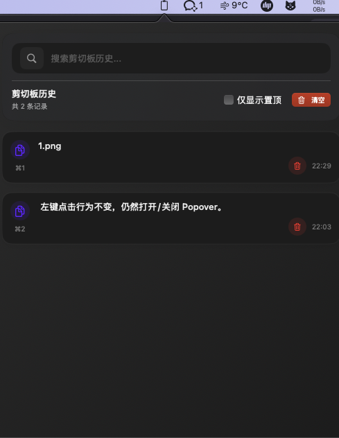
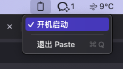

# Paste

macos 简易剪切板

## 下载使用
+ step1:下载[release](https://github.com/huskyui-im/paste/releases)里面的`Paste.zip`
+ step2:解压文件
+ step3:右击图标，开启自启动
+ `command+c` 复制任意文本信息
+ `command+shift+s` 截图
+ `command+shift+p` 打开应用
+ `command+1/9` 选择
+ `command+v` 粘贴

## 用户截图
### 页面


### 开启自启动


## 功能

监听command+c命令，并将文本记录到本地，最多10条
可以点击复制，将数据复制出来

## 如何构建应用

### 下载代码
```
git clone git@github.com:huskyui-im/paste.git
```
