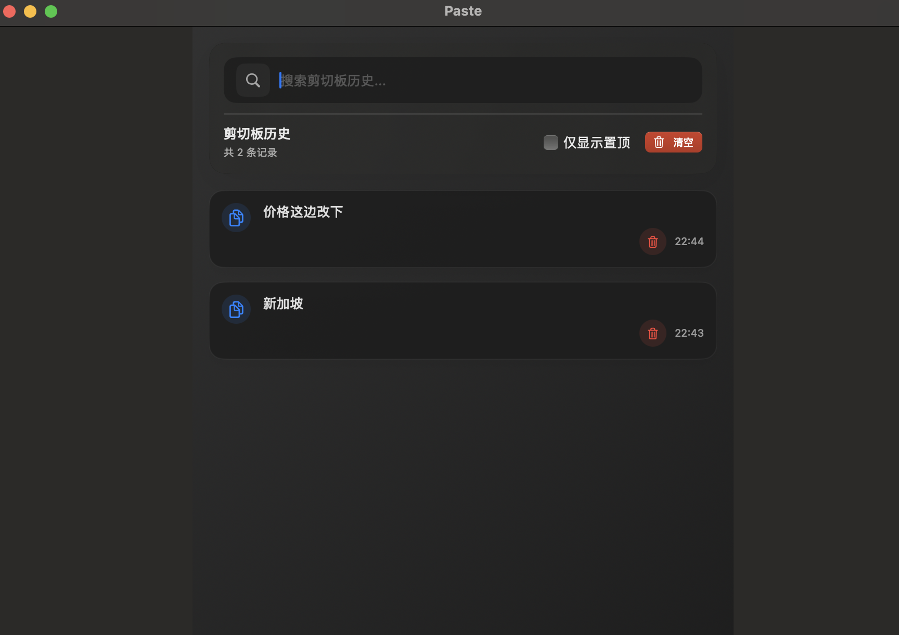

# Paste

macos 简易剪切板

## 用户截图



## 功能

监听command+c命令，并将文本记录到本地，最多10条
可以点击复制，将数据复制出来

## 如何构建应用

### 下载代码
```
git clone git@github.com:huskyui-im/paste.git
```

### xcode构建

通过xcode打开当前项目，product->Archive->Distribute APP->Custom->Copy App

