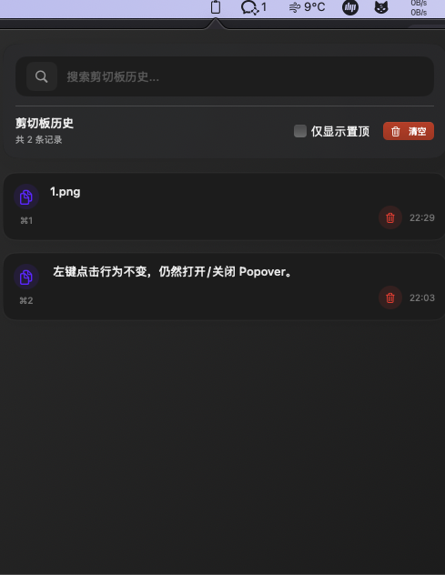
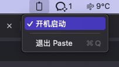

# Paste

macOS 轻量级剪贴板管理工具，常驻状态栏，支持剪贴板历史、截图、开发小工具。

## 功能

- **剪贴板历史** — 自动记录最近 10 条复制内容（文本 + 图片），支持搜索、置顶、删除
- **截图** — 全屏遮罩 + 拖拽选区，截图自动写入剪贴板
- **工具箱** — 内置开发常用工具（时间戳转换等）
- **开机自启动** — 右键状态栏图标开启

## 快捷操作

| 操作 | 快捷键 |
|------|--------|
| 打开应用 | `Command + Shift + P` |
| 截图 | `Command + Shift + S` |
| 快速选择第 N 条 | 弹窗内按数字 `1`-`9` |
| 上下导航 | `↑` / `↓` 方向键 |
| 确认选择 | `Enter` |
| 单击条目 | 复制并关闭弹窗 |

## 下载使用

1. 下载 [Release](https://github.com/huskyui-im/paste/releases) 中的 `Paste.zip`
2. 解压后拖入「应用程序」文件夹
3. 打开应用，状态栏出现剪贴板图标即可使用

## 截图预览

### 主界面


### 开启自启动


## 构建

```bash
git clone git@github.com:huskyui-im/paste.git
```

使用 Xcode 打开 `Paste.xcodeproj`，直接 Build & Run。
